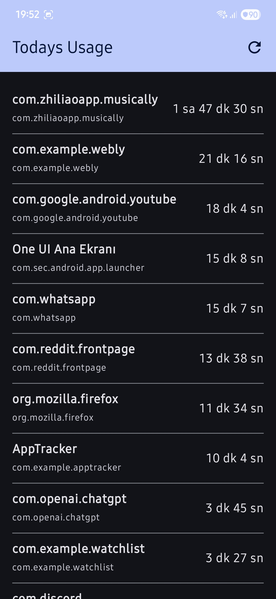

AppTracker: Android App Usage Tracker

AppTracker is a simple Android application built with Kotlin and Jetpack Compose that allows users to monitor their daily application usage. It leverages the Android UsageStatsManager to retrieve app usage data and stores it locally using Room Persistence Library.
Features

Here are some screenshots of the AppTracker app:

    Daily Usage Tracking: Displays a list of applications used on the current day, along with their total foreground usage time.

    Manual Refresh: A refresh button in the app bar allows users to manually update the usage statistics.

    Background Updates: Utilizes WorkManager to periodically fetch and update usage data in the background, ensuring the data remains fresh even when the app is not actively open.

    Permission Handling: Guides the user to grant the necessary "Usage Access" permission for the app to function.

    MVVM Architecture: Built following the Model-View-ViewModel (MVVM) architectural pattern for better separation of concerns, testability, and maintainability.

    Jetpack Compose UI: Modern declarative UI built entirely with Jetpack Compose.

    Room Database: Local persistence for app usage data.

Technologies Used

    Language: Kotlin

    UI Toolkit: Jetpack Compose

    Architecture: MVVM (Model-View-ViewModel)

    Persistence: Room Persistence Library

    Background Tasks: WorkManager

    System API: UsageStatsManager

    Dependency Management: Gradle Kotlin DSL (build.gradle.kts)

Setup and Running the Project

To get this project up and running on your local machine, follow these steps:

    Clone the Repository:

    git clone https://github.com/YOUR_GITHUB_USERNAME/AppTracker.git

    (Replace YOUR_GITHUB_USERNAME with your actual GitHub username)

    Open in Android Studio:

        Launch Android Studio.

        Select File > Open... and navigate to the cloned AppTracker directory.

        Let Gradle sync the project dependencies.

    Grant Usage Access Permission:
    This application requires a special permission called PACKAGE_USAGE_STATS to access app usage data. This permission cannot be requested directly via a runtime dialog; the user must grant it manually from the device settings.

        When you first run the app, you will see a screen prompting you to grant permission.

        Tap the "İzin Ver" (Grant Permission) button.

        This will take you to your device's "Usage Access" settings.

        Find "AppTracker" in the list and enable the permission for it.

        Press the back button to return to the AppTracker application.

    Run the Application:

        Connect an Android device or start an emulator.

        Click the Run button (green triangle) in Android Studio.

    The app should now display a list of applications with their usage times for the current day. You can use other apps on your device, then return to AppTracker and tap the refresh button to see updated times.

Important Notes

    Usage Access Permission: Without the "Usage Access" permission, the app cannot retrieve any usage statistics and will display a permission request screen.

    Data Accuracy: The UsageStatsManager provides data based on the device's tracking. There might be slight delays in real-time updates depending on the Android system's behavior.

    Background Work: WorkManager ensures that data is collected periodically in the background (e.g., every 15 minutes), but immediate updates require a manual refresh or opening the app.
